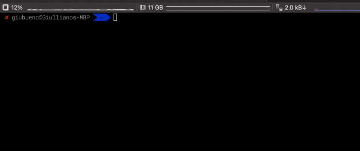

# songs
This is a small program that takes the name of an artist as input and outputs a list of all of the songs by that artist.

## Configuration

This command assume that you have at least the CLIENT_ACCESS_TOKEN environment variable set with an access key obtained from https://genius.com/api-clients.

You can change the URL of the Genius API by setting the GENIUS_API_URL environment variable. By default it uses https://api.genius.com/search.

## How to Use

```bash
songs Dan Torres

Dan Torres

0 - Lucy in the Sky with Diamonds by Dan Torres
1 - The Way You Look Tonight by Dan Torres
2 - Splendor by Dan Torres
3 - Lay Lady Lay by Dan Torres
4 - Unchained Melody by Dan Torres
5 - Blues De La Bahia by La Macanita
6 - Ziek by Seffelinie
7 - Los Estratocúmulos by Menuda Coincidencia
8 - 2 Coole Bitches by Kraeven Da Hunter
9 - Darkness by Diamond Deuklo (Ft. Léa and Ferdi)
```

You can use this command with pipes. For example:

```bash
echo "Dan Torres" | songs | grep Lady
3 - Lay *Lady* Lay by Dan Torres
```



## Development

### Dependencies

This program has a simple terminal UI written in Go with the [gocui](https://github.com/jroimartin/gocui) library.

### Compiling

You can compile this program as follow:

```bash
make build
```

The binary will save in the bin folder.

### Testing

You can test this program as follow:

```bash
make test
```
